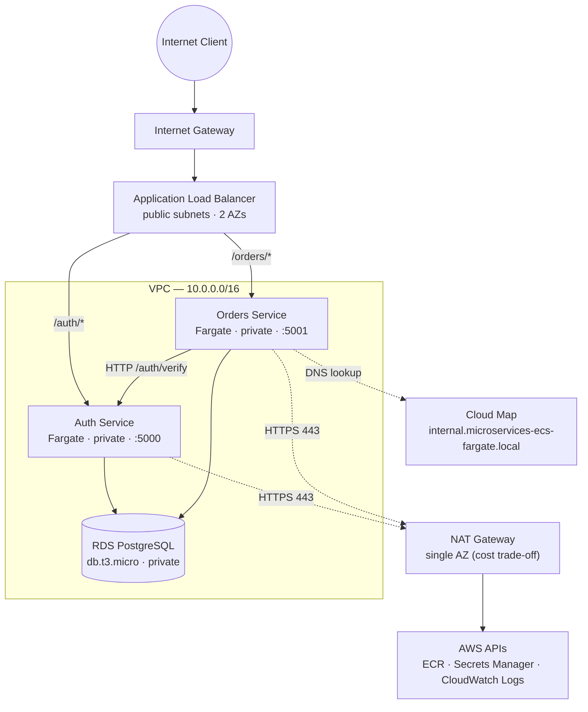

# Microservices on ECS Fargate — Auth & Orders

A containerized microservices system deployed on AWS ECS Fargate, built
to implement production-style infrastructure: multi-AZ networking,
least-privilege security groups, private service-to-service discovery,
secrets injected at runtime, and measured observability.

## Architecture



The ALB spans both public subnets (one per AZ). Both ECS tasks and the
RDS instance live in private subnets with no public IP. Outbound traffic
like image pulls, secret fetches, log writes, goes through a single NAT
gateway, which is a deliberate cost trade-off (see "Known limitations").

## AWS services used

| Service | Role |
|---|---|
| **ECS Fargate** | Runs the Auth and Orders containers without managing EC2 hosts |
| **ECR** | Private image registry, one repository per service |
| **Application Load Balancer** | Internet-facing, spans 2 public subnets in 2 AZs; path-based routing to `auth-tg` and `orders-tg` |
| **Target Groups** | One per service, HTTP health checks against `/<service>/health` |
| **RDS PostgreSQL** | `db.t3.micro`, deployed in a DB subnet group across the 2 private subnets |
| **Secrets Manager** | Stores the DB credentials JSON; fields are injected into ECS tasks at runtime via `secrets[]` |
| **AWS Cloud Map** | Private DNS namespace for service-to-service discovery |
| **NAT Gateway** | Single-AZ egress for tasks in private subnets to reach AWS APIs |
| **CloudWatch Logs** | One log group per service, `awslogs` driver |
| **IAM** | Task execution role + task role with scoped permissions |
| **VPC** | `10.0.0.0/16`, 2 public + 2 private subnets across 2 AZs |

## Networking and security design

**Subnets.** Two public (one per AZ, for the ALB and NAT) and two
private (one per AZ, for the ECS tasks and RDS). Private subnets have no
route to the internet gateway and their default route points at the NAT
gateway instead.

**Security groups (5 total).** Traffic flows are locked down by
reference, not by CIDR:

| SG | Ingress | Egress |
|---|---|---|
| `alb-sg` | 80 from `0.0.0.0/0` | 5000/5001 to `auth-sg`/`orders-sg` |
| `auth-sg` | 5000 from `alb-sg`, from `orders-sg` | 5432 to `rds-sg`; 443 to internet (via NAT); 5000 to `orders-sg` |
| `orders-sg` | 5001 from `alb-sg` | 5432 to `rds-sg`; 443 to internet (via NAT); 5000 to `auth-sg` |
| `rds-sg` | 5432 from `auth-sg` and `orders-sg` | (default) |
| (VPC default) | unused | unused |

13 total ingress + egress rules, all defined in Terraform.

**Egress path.** Private-subnet tasks reach ECR, Secrets Manager, and
CloudWatch Logs over HTTPS through the NAT gateway. This is the
alternative to VPC interface endpoints — see "Known limitations" for
why this was chosen.

## Deployment environment: constrained AWS sandbox

This was deployed against a **KodeKloud AWS Sandbox Playground**. The
sandbox enforces restrictions that shaped the final architecture.

## Measured results

Captured from a live deployment via two audit scripts
(`tests/infra_audit.sh`, `tests/measure_performance.sh`), run from AWS CloudShell in the same region.
Full outputs are under `docs/`.

**Infrastructure**
- **70** Terraform-managed resources
- **4 subnets** (2 public, 2 private) across 2 AZs
- **5 security groups**, **13** ingress + egress rules combined
- **1 NAT gateway** (single-AZ)
- **2 ECS services** both `ACTIVE` and both target groups reporting
  **2/2 healthy** targets

**Runtime latency** (intra-region, measured from CloudShell):

| Endpoint | Latency | Status |
|---|---|---|
| `GET /auth/health` | **8 ms** avg (10 requests) | 10/10 HTTP 200 |
| `GET /orders/health` | **6 ms** avg (10 requests) | 10/10 HTTP 200 |
| `POST /auth/register` | **22 ms** | HTTP 201 |
| `POST /auth/login` | **14 ms** | HTTP 200 |
| `POST /orders/` | **39 ms** | HTTP 201 |
| `GET /orders/` | **15 ms** | HTTP 200 |

The 39 ms for order creation is the only metric that reflects the
**full path**: ALB → orders task → Cloud Map DNS → auth `/auth/verify`
→ return → RDS write → response. That's four network hops and one
database write in under 40 ms.

**Reliability**
- **0** error-level log events across both services in the preceding hour
- 100% ALB target health across the measurement window

**Cold-start time** (Fargate task creation → RUNNING, includes image pull,
secret injection, and health-check pass):
- Auth: **~49 s**
- Orders: **~113 s**

## Repo structure

```
terraform/          — IaC for VPC, ECS, RDS, ALB, IAM, Cloud Map
app/
  auth-service/     — Flask: /auth/register, /auth/login, /auth/verify
  orders-service/   — Flask: /orders/ (create, list, get), calls auth via Cloud Map
tests/
  infra_audit.sh        — audits AWS resources against Terraform state
  measure_performance.sh — end-to-end latency and functional tests
docs/
  infra-report.md          — generated infrastructure snapshot
  runtime-report.md        — generated runtime + latency measurements
terraform-cicd/     — reference CodePipeline + CodeDeploy blue/green config
                      
```

## Deployment

```bash
cd terraform
terraform init
terraform plan
terraform apply
```

## Known limitations

- **Single-AZ NAT gateway.** All private-subnet egress funnels through
  one NAT in one AZ. A production setup would run one NAT per AZ for
  resilience — the trade-off here was cost (~$32/mo per NAT in
  `us-east-1`).
- **NAT over VPC endpoints.** The initial design used VPC interface
  endpoints for ECR, Secrets Manager, and CloudWatch Logs, but the
  number of resources (5 endpoints + SG rules + `private_dns_enabled`
  config) plus the debugging surface outweighed the marginal security
  benefit for a single-account sandbox. NAT was chosen for simplicity.
- **No automated pipeline in this sandbox.** CodePipeline, CodeDeploy,
  and CodeBuild cannot be created due to the SCP on `iam:PassRole`. The
  Terraform for the blue/green pipeline lives in `terraform-cicd/` as
  reference code.

## What I'd change in a production account

- **One NAT gateway per AZ** for cross-AZ redundancy.
- **Interface VPC endpoints** for ECR, Secrets Manager, and CloudWatch
  Logs to remove the NAT dependency for AWS API traffic.
- **CodePipeline + CodeDeploy with blue/green** deployment groups, using
  CloudWatch alarms for automatic rollback on 5xx rate or unhealthy
  target counts.
