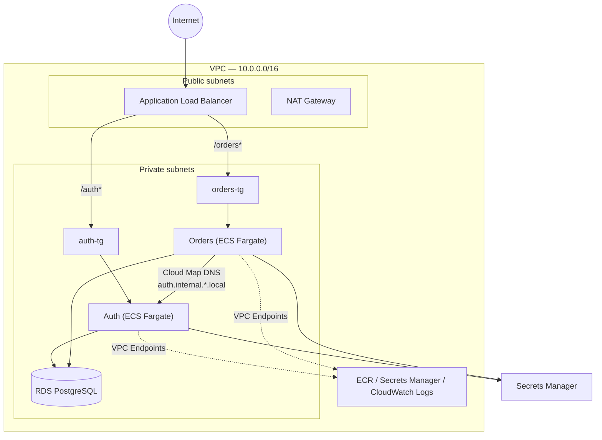

# Microservices on ECS Fargate — Auth & Orders

A containerized microservices system (Auth + Orders) deployed on AWS ECS
Fargate, built to implement production-style infrastructure practices:
private networking, least-privilege IAM, service discovery, and secrets
management.

## Architecture



## AWS services used

| Service | Role |
|---|---|
| ECS Fargate | Runs the Auth and Orders containers, without server management |
| ECR | Private image registry for both services |
| ALB + Target Groups | Path-based routing (`/auth*`, `/orders*`) |
| RDS (PostgreSQL) | Persistent storage for users and orders |
| Secrets Manager | For sensitive DB credentials, generated via Terraform's `random_password` and injected per-field into the ECS tasks |
| Cloud Map | Private DNS service discovery — Orders resolves Auth by name, not a hardcoded address |
| VPC Endpoints | Private, non-internet-routed access to ECR, Secrets Manager, and CloudWatch Logs |
| CloudWatch Logs | Container logs, one log group per service |
| IAM | Roles with least-privilege access 

## Deployment environment: a constrained AWS sandbox

This was deployed against a KodeKloud AWS Sandbox Playground, which
imposes restrictions beyond a standard AWS account. 

## Measured results

Captured from a live deployment via two audit scripts (`tests/infra_audit.sh`,
`tests/measure_performance.sh`), run from AWS CloudShell in the same region:

**Infrastructure**
- 70 Terraform-managed resources across networking, compute, database, and
  secrets
- 4 subnets (2 public, 2 private) across 2 AZs, 5 security groups, 13
  ingress/egress rules
- 2 ECS services, both `ACTIVE`, both target groups reporting `healthy`

**Runtime**
- Health-check latency: **~8ms average (Auth)**, **~6ms average (Orders)**
  over 10 requests each, measured intra-region
- End-to-end functional test: register (22ms) → login (14ms) → create
  order (39ms) → list orders (15ms), all `2xx`
- 0 error-level log events across both services in the preceding hour

## Repo structure

```
terraform/     — for infrastructure as code to provision the AWS resources
auth-service/  — Flask app: registration, login, token verification
orders-service/— Flask app: order creation and retrieval
tests/         — infra_audit.sh, measure_performance.sh
docs/          — generated infra-report.md, runtime-report.md
```

## Deploying

```bash
cd terraform
terraform init
terraform plan
terraform apply
```

See `docs/infra-report.md` and `docs/runtime-report.md` for a snapshot of
the last verified deployment.